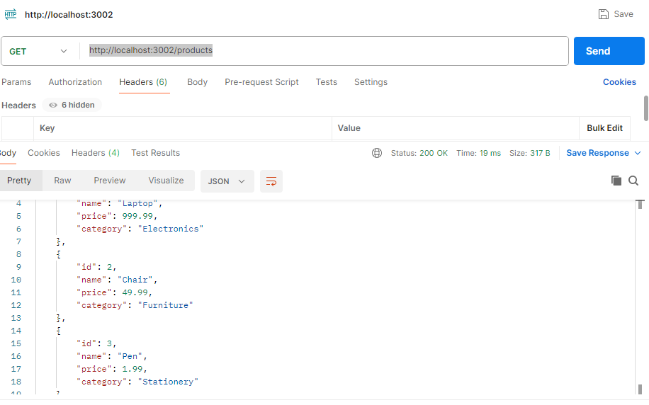
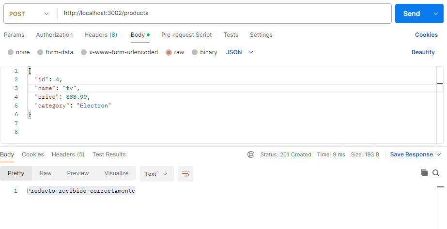

## FUNCIONAMINETO TAREA 6
#### Accede a las siguientes rutas en un navegador o cliente HTTP  Postman
#### http://localhost:3002/: Responde con "este es el inicio".
http://localhost:3002/products: Responde con la lista de productos en formato JSON.
Cualquier otra ruta: Responde con "404 not found".

#### COMO CONSULTAR EN POSTMAN
#### Metodo GET
#### http://localhost:3002/products
#### la respuetas debe ser como se muetra en la imagen

## Recibir un producto nuevo y agregarlo al array de productos
### Metodo POST
### Posicionarnos en Body luego raw
### y le pasamos en formato json los datos de un producto nuevo ejemplo
### {
  ### "id": 4,
  ### "name": "tv",
  ### "price": 888.99,
  ### "category": "Electron"
### }
### y damos enviar la respuesta debe ser
### Producto recibido correctamente  como se muestra en la siguiente imagen

