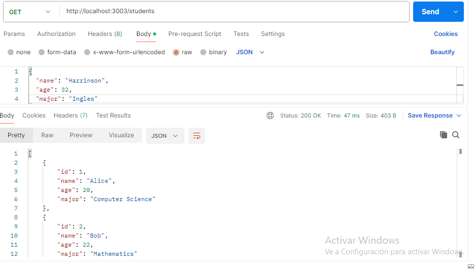
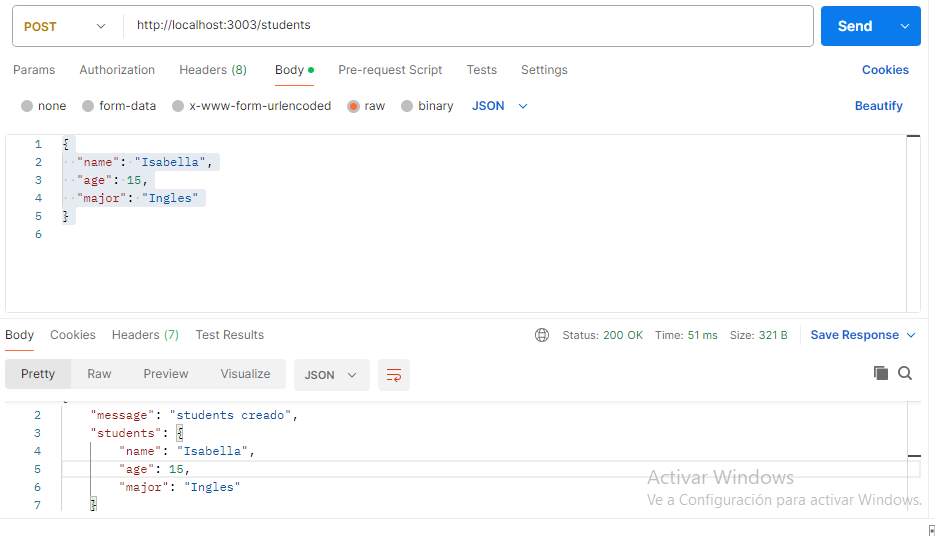
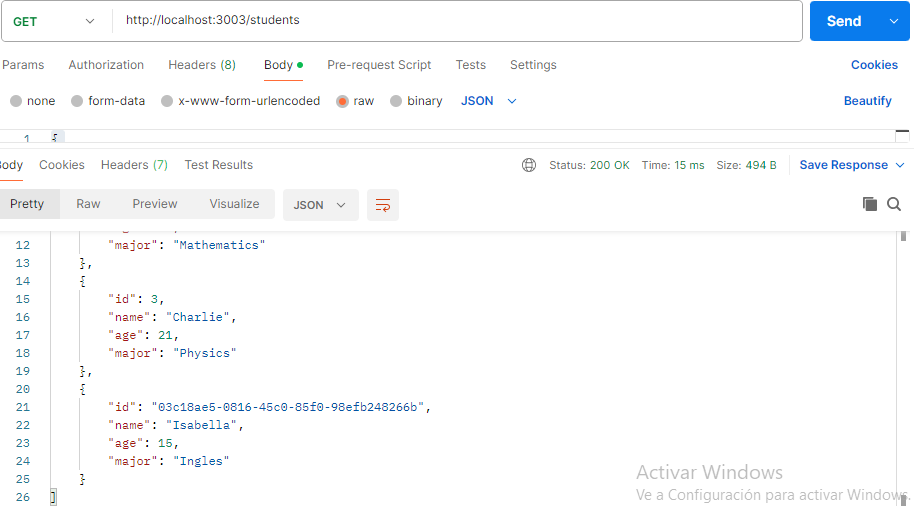

# Creacion de  una API Básica con Express Clase 7
### Esta API  gestiona una lista de estudiante
### Utilizando la libreria express
### utilizaremos UN array como BD para consultar el metodo Get y para agregar estudiantes el metodo POST ASI

### postman GET /students: consUltamos los estudiantes como se muestra en la siguiente imagenn

### ### postman POST apara agregar estudianbtes a nuestra API
#### agregaremos el siguiente estudiante cooejemplo
{
  "name": "Isabella",
  "age": 15,
  "major": "Ingles"
}

### nos debe retornar students creado como se muestra en la siguiente imagen

### pàra que nos muestra los estudiantes existentes mas el que se agrego utilziamos nuevamentE el metodo GET COMO SE MUESTRA EN LA SIGUIENTE IMAGEN CON EL NUEVOEVO ESTUDIANTE

### EXPRES es excelente  