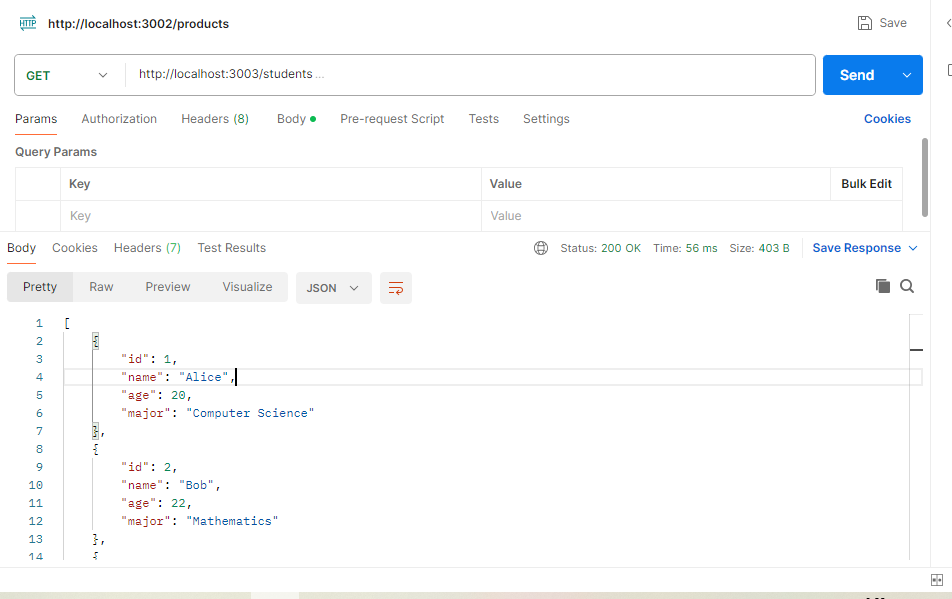
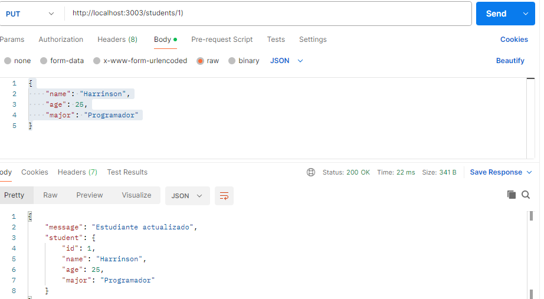
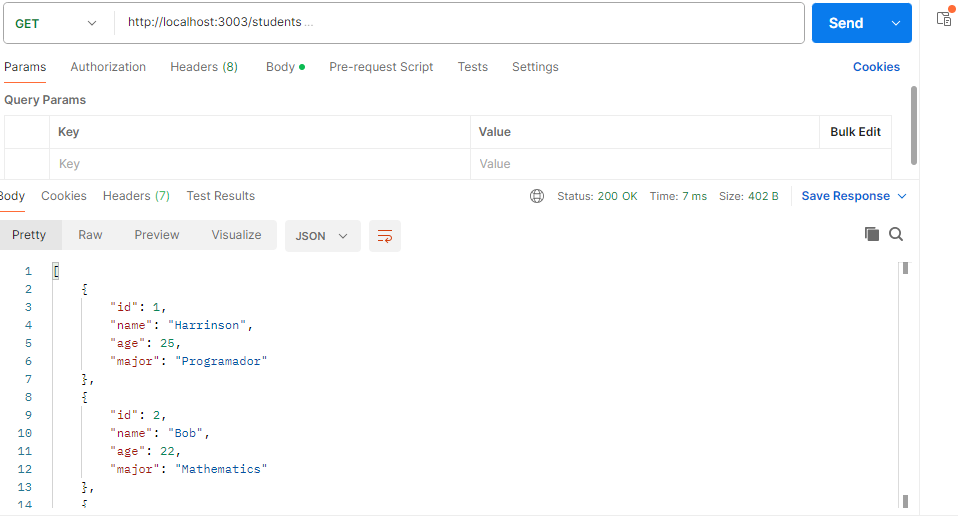
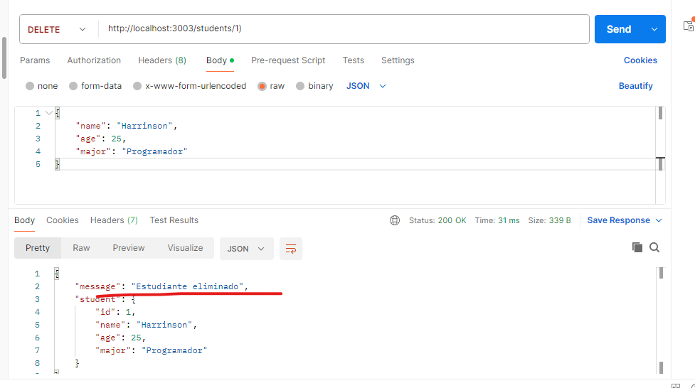
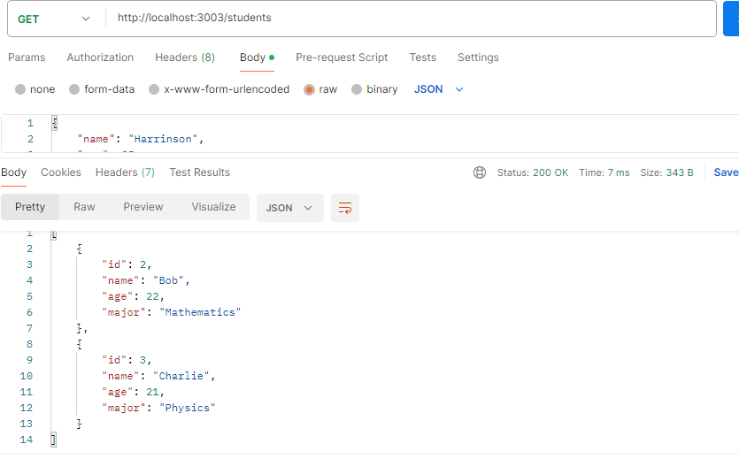

## nuevos endpoints para crear, actualizar y borrar estudiantes.
### usando el metodo GET consultamos los estudiantes comose muestra en la imagen

### ahora hemos agregado dos metodos a la api que son PUT y DELETE

### utilicemos el metodo PUT Actualizar  actualicemos el id u1 utilziando PUT en Postmasn /students/1 asi le actualzizaemos los siguientes datos
{
    "name": "Harrinson",
    "age": 25,
    "major": "Programador"
}
### el resultado debe ser como se muestra en la siguiente imagen 

### hagamos uso de  el metodo GET para consultar los cambios realizados 
### los cambis se deben reflejar como se ve en la siguiente imagen 

### ahora eliminemos el estudiante que hemos actualziado utilziando el metodo DELETE en postmas asi students/1
### se debe generar el mensaje configurado estudiante eliminado como se muestra en la siguiente imagen

### hagamos uso de  el metodo GET para consultar los cambios realizados de nuestra api

### como se muestra en la imagen ya no deberiamos tenes el estudioante con el id 1
